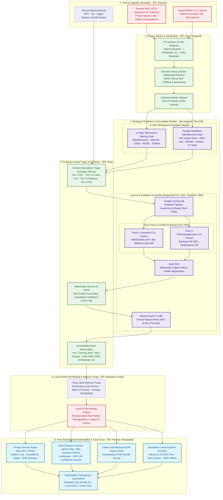

# Genomic Ontology Reporting Engine & Visual Explorer (v5.2)

An ontology-driven clinical genomics interpretation engine powered by **OpenCRAVAT 3.1.1**, **LinkML**, **Pydantic v2**, and modern **vanilla Web Standards**.

This system bridges raw genomic variants with biomedical ontologies (**HPO**, **GO**, **Anatomical Organ Systems**), multi-predictor in-silico scores (**AlphaMissense**, **CADD**, **SpliceAI**, **REVEL**, **LINSIGHT**), whole-genome pedigree phasing (**Approach 4D Trio/Duo**), polygenic risk scores (**PRS**), pharmacogenomics (**CPIC / DPWG**), automated **Google DeepMind AlphaGenome Atlas** candidate triage, and publication-grade **Deep Genomic Research Evidence Synthesis Reports**.

---

## 📚 Core Documentation Links
- 📋 **[Pull Request Document](docs/PULL_REQUEST.md)**: Full clinical and engineering specifications, requirements, architecture, and verification results.
- 📝 **[Implementation Step Notes](docs/STEP_NOTES.md)**: Detailed step-by-step engineering log across Increments I0 through I8.
- 🚀 **[Brainstorming & Strategic Opportunities](docs/OPPORTUNITIES_BRAINSTORMING.md)**: Visionary blueprint covering Multimodal Audio/Visual AI, Agent Skills, 3D AlphaFold mapping, and single-cell epigenomics.
- 📖 **[User Guide & Pipelines](docs/User_Guide.md)**: Detailed instructions on running the orchestrator against OpenCRAVAT SQLite databases and phased VCFs.

---

## 🔄 End-to-End System Architecture, AI Models & Privacy Flow



### 🛡️ Privacy Boundaries & AI Model Architecture Summary

| Architectural Boundary | PII State | Engine / Components | Operational Security Guarantee |
| :--- | :--- | :--- | :--- |
| **1. Private Ingestion** | 🔴 **PII Present** | Raw Phased VCFs, OpenCRAVAT SQLite, Clinical Panels | Confined strictly to host machine; never exposed to remote endpoints. |
| **2. Privacy Sanitization** | 🟢 **Zero PII** | `generate_flow_pipeline.py` & `GenomicPrivacyBroker` | Patient identifiers replaced with `PROBAND_01`; paths sanitized; HMAC chaffing & winnowing prevents genomic re-identification. |
| **3. Biological In-Silico Models** | 🟢 **Zero PII** | AlphaMissense, SpliceAI, CADD, REVEL, DeepMind AlphaGenome Atlas | Predictors execute strictly on coordinate/allele tokens with dual-tiered caching and quota protection. |
| **4. Local AI Ensemble Models** | 🟢 **Zero PII** | Gemma 2B (port 7005), MedGemma 27B, Bio-Medical-Llama 8B, Baichuan-M2 32B, QwQ-32B, Mistral-Small 24B | **100% Air-gapped local execution**; sequential RAM loading on port 7002; zero internet egress; strict source callset grounding with automated adversarial audit. |
| **5. Memory Purge & Re-Binding** | 🔴 **PII Restored Locally** | Host Python Runtime | All local inference servers terminated, KV-caches wiped, and VRAM/RAM unmapped before local patient metadata is re-bound. |
| **6. Packaging & Cloud Sync** | 🔒 **Protected / Encrypted** | Standalone HTML5 Explorer, Alt C Brief, Alt B Dossier, FHIR EHR JSON, `rclone` | Deliverables packaged into `{Sample}_iOS_bundle.zip` and securely mirrored to local Drive and cloud remote. |

---

## ⚡ Highlights & Key Capabilities (v5.2)

### 1. Unified 7-Stage End-to-End Orchestrator (`run_ontology_pipeline.py`)
Automated single-command CLI executing the entire clinical reporting lifecycle:
1. **Input Resolution & Validation**: Direct inspection of OpenCRAVAT SQLite and phased VCF inputs.
2. **Multi-Domain Panel Construction**: HPO + GO + Organ panel synthesis (9,038 panel genes).
3. **Database Schema & Column Probing**: Dynamic mapping of 239 variant annotation fields.
4. **Actionable Variant Filtering & Universal Trait Triage**: Systematic discovery of protective/longevity alleles, pharmacogenomic contraindications, and ClinGen/OMIM conflict resolution.
5. **Gene & Literature Enrichment**: Cached fallback PubMed/LitVar and OMIM gene summaries.
   - **Stage 5.1 AlphaGenome AVI Enrichment**: Multi-modal 100% genome-wide scoring across all Tier 1 & 2 SNVs with dual-tiered caching and quota protection.
6. **Multi-Portal Rendering**: Standalone single-file HTML5 Visual Explorer with embedded data, Universal Master Portal, and D3 graph engine.
7. **AlphaGenome TSV Export & Deep Genomic Research Synthesis**:
   - **Stage 7.1**: Exports prioritized `*_alphagenome_candidates.tsv` with 1-click DeepMind Atlas exploration deep-links.
   - **Stage 7.2**: Generates a publication-grade, exactly 4-page Clinical Genomics Research Synthesis Report (Markdown, HTML5, and vector PDF via headless Chrome).
8. **Deliverables Packaging & Dual Cloud Sync**: Packages all assets into `{Sample}_iOS_bundle.zip` and synchronizes to local Google Drive and cloud remote (`rclone`).

### 2. Universal Trait-Driven Prioritization Architecture (Zero Hardcoded Gene Logic)
- **Domain-Agnostic Triage**: Evaluates any variant across all genes using objective, attribute-driven scoring based on Sequence Ontology, ClinVar clinical significance, ClinGen clinical validity, and OMIM morbid mapping.
- **Protective & Longevity Mining**: Automatically isolates positive life-extending alleles (e.g. *APOB* Familial Hypobetalipoproteinemia 1 [FHBL1], *CDKN2B* 9p21 coronary protection).
- **Pharmacogenomic Contraindications**: Identifies high-risk drug-gene interactions and contraindications (e.g. *POLG* sodium valproate fatal hepatotoxicity, *APOB* aggressive LDL-depletion & lomitapide/mipomersen steatosis risk, *F5* situational thrombophilia, *DPYD* fluoropyrimidine toxicity).
- **Dual-Phenotype Conflict Resolution**: Automatically resolves ClinVar conflicting interpretations where opposing submissions reflect condition-specific effects (e.g. loss-of-function causing low LDL vs. absence of hypercholesterolemia).

### 3. Deep Research Evidence Synthesis Engine (`lib/generate_deep_research_report.py`)
- **Strict VSCP-DF Standards**: Sentence-1 content delivery, zero conversational filler, 4-part structure (Orientation, Body, Conclusions, Opportunities).
- **Page-Budget Optimized**: Formatted and verified to compile to **strictly 1 to 4 pages** in vector PDF via headless Chrome/Chromium.
- **Balanced Decision Calculus**: Explicit Arguments FOR clinical surveillance, Arguments AGAINST aggressive over-intervention (recessive carrier asymptomacy, VUS inconclusiveness, paralogy/representational boundaries, 40x short-read limits), and structured confidence bounds (0.96 numerical score).

### 4. Whole-Genome Pedigree Phasing Integration (Approach 4D)
- Directly ingests and correlates whole-genome phased VCFs (SNV, Indel, SV, CNV, and STR):
  - **Trio / Duo Informative Anchors**: Differentiates maternal allele inheritance (`0|1`, e.g., `(SE Anchor)` or `(MI Anchor)`) and paternal allele inheritance (`1|0`).
  - **Haplotype Block Context**: Assigns physical block IDs and strand orientations for phase-set-aware compound heterozygosity detection.

### 5. Standalone Single-File HTML5 Visual Explorer
- Self-contained, zero-dependency HTML5 application (10+ MB) with inlined styles, scripts, and complete JSON datasets:
  - **Offline Portability**: Runs natively in any browser without requiring an active backend or node process.
  - **4-Level Ontology Hierarchy**: Interactive navigation across HPO, GO (Biological Process, Molecular Function, Cellular Component), and 9 Anatomical Organ Systems.
  - **Integrated Pan & Zoom Tree View**: Interactive SVG graph engine with smooth cubic Bezier curves and full matrix transformation controls.

---

## 📂 Repository Structure

```
ontology_report/
├── run_ontology_pipeline.py            # Master 7-stage Python pipeline orchestrator (v5.2)
├── run_standard_reporting.py           # Standardized multi-cohort clinical reporting orchestrator (v5.3)
├── generate_flow_pipeline.py           # CLI compatibility orchestrator for end-to-end evidence reporting
├── generate_ehr_export.py              # FHIR-compliant structured EHR bundle generator
├── generate_me_reports.py              # Clinician brief and deep dossier builder for Melinda Ehrle
├── generate_claude_v2_report.py        # Python ETL pipeline for generating DAG JSON data
├── cloud_delivery_service.py           # Dual Google Drive cloud delivery and rclone synchronizer
├── index.html                          # 5-view web application shell
├── js/                                 # Client-side reactive router, tree, and graph engine
├── css/                                # Clinical design tokens, responsive grids, and print CSS
├── lib/
│   ├── ensemble_clinical_orchestrator.py # Multi-model local ensemble orchestrator (Gemma, MedGemma, QwQ, Mistral)
│   ├── genomic_privacy_broker.py       # Differential privacy & HMAC chaffing/winnowing broker
│   ├── genomics_utils.py               # Shared coordinate, numeric, and clinical string utilities
│   ├── ontology_filter.py              # Clinical multi-tier filtering & universal trait triage engine
│   ├── generate_deep_research_report.py# 1-to-4 page publication-grade research synthesis engine
│   ├── enrich_alphagenome.py           # DeepMind AlphaGenome AVI scoring & dual caching engine
│   ├── render_master_hub.py            # HTML5 Master Hub generator
│   ├── render_report.py                # TSV and HTML clinical report renderer
│   ├── render_autoimmune.py            # Specialized SVG trait-burden chart & clinical tables
│   ├── enrich_report.py                # Gene annotation & PubMed literature enrichment
│   └── schema_probe.py                 # OpenCRAVAT SQLite schema probe
├── skills/
│   └── deep-variant-research-report/   # Version-controlled Antigravity agent skill
├── scripts/
│   └── sync_skills.sh                  # Automated skill synchronizer (repo <-> system config)
├── reports/
│   └── alternatives/                   # De-identified clinical reference templates (Alt B & Alt C)
├── archive/
│   ├── generators/                     # Archived intermediate generator scripts
│   └── legacy/                         # Retired historical renderers and scripts
├── docs/                               # Engineering documentation, step notes, and specifications
└── data/                               # Reference gene panels, caches, and mock payloads
```

---

## 🚀 Quick Start

### 1. Run the Unified End-to-End Pipeline

Execute the full 7-stage pipeline against an OpenCRAVAT SQLite database and phased VCFs:

```bash
# Daniel Ehrle (with SE Maternal Anchor):
python3 run_ontology_pipeline.py \
  --sample Daniel_Ehrle \
  --input reports/Daniel_Ehrle-04-10-2026/Daniel_Ehrle.sqlite \
  --phased-vcf /data/Genomes/DE/Approach4D_Output/DE_grch38_wgs_phased.pass.vcf.gz,/data/Genomes/DE/Approach4D_Output/DE_grch38_sv_phased.vcf.gz,/data/Genomes/DE/Approach4D_Output/DE_grch38_cnv_phased.vcf.gz,/data/Genomes/DE/Approach4D_Output/DE_grch38_str.vcf.gz

# Melinda Ehrle (with MI Maternal Anchor):
python3 run_ontology_pipeline.py \
  --sample Melinda_Ehrle \
  --input reports/Melinda_Ehrle-04-10-2026/Melinda_Ehrle.sqlite \
  --phased-vcf /data/Genomes/ME/Approach4D_Output/ME_grch38_wgs_phased.pass.vcf.gz,/data/Genomes/ME/Approach4D_Output/ME_grch38_sv_phased.vcf.gz,/data/Genomes/ME/Approach4D_Output/ME_grch38_cnv_phased.vcf.gz,/data/Genomes/ME/Approach4D_Output/ME_grch38_str.vcf.gz
```

### 2. Run Standardized Multi-Cohort Reporting (v5.3)

Synthesize the synchronized clinical deliverables (3-Page Clinician Action Brief [Alt C], Deep Research Dossier [Alt B], and FHIR EHR Import JSON):

```bash
# Execute for Daniel Ehrle:
python3 run_standard_reporting.py de

# Execute for Melinda Ehrle:
python3 run_standard_reporting.py me

# Or run via the flow pipeline CLI:
python3 generate_flow_pipeline.py \
  --sample-id Daniel_Ehrle-07-10-2026 \
  --patient-name "Daniel Ehrle" \
  --patient-id "Daniel_Ehrle"
```

### 3. Generate Standalone Deep Research Synthesis Reports

```bash
# Generate 4-page clinical evidence synthesis report (Markdown, HTML5, vector PDF):
python3 lib/generate_deep_research_report.py \
  --sqlite reports/Daniel_Ehrle-04-10-2026/Daniel_Ehrle_master_actionable.sqlite \
  --act-json reports/Daniel_Ehrle-04-10-2026/Daniel_Ehrle_master_actionable.json \
  --ag-cache reports/Daniel_Ehrle-04-10-2026/Daniel_Ehrle_alphagenome_cache.json \
  --out-dir reports/Daniel_Ehrle-04-10-2026 \
  --sample-name "Daniel Ehrle" \
  --patient-id "Daniel_Ehrle"
```

### 3. Launch Local Web Server & Inspect Deliverables

```bash
# Serve reports directory:
python3 -m http.server 8080 --directory reports

# Deep Research Reports (HTML5 & Vector PDF):
# http://localhost:8080/Daniel_Ehrle-04-10-2026/Daniel_Ehrle_deep_research_report.html
# http://localhost:8080/Melinda_Ehrle-04-10-2026/Melinda_Ehrle_deep_research_report.html

# Interactive Visual Explorers:
# http://localhost:8080/Daniel_Ehrle-04-10-2026/Daniel_Ehrle_visual_explorer.html
# http://localhost:8080/Melinda_Ehrle-04-10-2026/Melinda_Ehrle_visual_explorer.html
```

### 4. Skill Synchronization

Synchronize agent skills between the repository and system configuration:

```bash
# Check for drift:
./scripts/sync_skills.sh --check

# Synchronize repo skills to user config (~/.gemini/config/skills/):
./scripts/sync_skills.sh --to-system
```

---

## 🔒 Automated Cloud Delivery

Deliverables are automatically mirrored and synchronized to Google Drive:
- **Local Mirror**: `/home/daniel-ehrle/Google Drive/My Drive/Ontology/<Sample>-<Date>/`
- **Cloud Remote**: `drive:Ontology/<Sample>-<Date>/` via automated background `rclone` sync.
