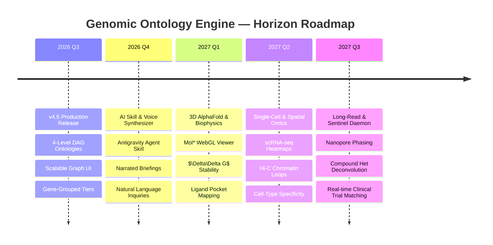

# Brainstorming & Strategic Opportunities: Next-Generation Genomic Ontology Intelligence

This document outlines visionary architecture, research vectors, and high-impact capabilities to elevate the **Genomic Ontology Reporting Engine** from a static clinical report into an autonomous, multi-modal precision genomics intelligence platform.

---

## 🌟 1. Multimodal Audio/Visual Clinical Briefings & Voice AI Synthesizer

### Concept
Transform complex variant-to-phenotype data into interactive, spoken clinical briefings for physicians and personalized, empathetic audio guides for patients.

### Architecture & Capabilities
* **Dual-Track Audio Generation**:
  * **Clinician Mode**: High-density, 3-minute executive briefing summarizing monogenic findings (e.g., *SCN5A* arrhythmia risk), compound heterozygosity, and CPIC Tier 1 pharmacogenomics recommendations using formal ACMG nomenclature.
  * **Patient Mode**: Conversational, jargon-free podcast-style explanation explaining what the findings mean for daily health, cardiovascular exercise, or dietary absorption (e.g., *CBLIF* cobalamin malabsorption) with empathetic tone conditioning.
* **Synchronized Waveform Scrubbing**:
  * The web UI highlights the corresponding gene card, SVG exon lollipop, or ontology graph node in real time as the AI narrator discusses that specific locus.
* **Interactive Voice Q&A ("Talk to Your Genome")**:
  * Clinicians can ask questions via voice input: *"What is the maternal haplotype contribution to the patient's lipid profile?"* or *"Are there drug interactions between the patient's CYP2D6 status and beta-blockers?"*

---

## 🤖 2. Autonomous Genomic AI Skill (`genomics-ontology-skill`)

### Concept
Package the ontology engine, LinkML schema, and OpenCRAVAT pipelines into a native agent skill (compatible with Google Antigravity, Gemini CLI, Claude MCP, and OpenAI tool protocols).

### Architecture & Capabilities
* **Natural Language Clinical Inquiries**:
  * Enables agents to execute structured SPARQL / Cypher / SQL queries against the patient's ontology graph:
    * `Query: "Find all de novo missense variants in cardiac potassium channel complexes with CADD > 25, REVEL > 0.7, and LOEUF < 0.35."`
* **Automated Differential Diagnostic Engine**:
  * Computes semantic similarity metrics (Resnik / Lin similarity distance) between the patient's observed HPO phenotype set and rare disease models in OMIM, Orphanet, and ClinVar to rank potential undiagnosed syndromes.
* **Automated ACMG/AMP Guideline Classification Agent**:
  * Executes continuous real-time evidence evaluation against the 28 ACMG/AMP criteria (PVS1, PS1-4, PM1-6, PP1-5, BA1, BS1-4, BP1-7) with verifiable citation chains.

---

## 🧬 3. Interactive 3D Protein Structure & AlphaFold Variant Mapping

### Concept
Embed real-time 3D biomolecular structure visualization directly inside the gene and variant cards, projecting missense mutations onto AlphaFold 3-predicted protein structures.

### Architecture & Capabilities
* **Embedded WebGL Mol* / 3Dmol.js Viewer**:
  * When viewing a variant in *SCN5A* or *APOB*, an interactive 3D protein viewer renders the folded channel domain.
* **Biophysical Impact Quantification**:
  * **Residue Hotspot Highlighting**: Pinpoints the mutated amino acid in 3D space with surface electrostatic potential maps (red: acidic, blue: basic).
  * **$\Delta\Delta G$ Stability Prediction**: In-browser calculation of thermodynamic folding stability changes ($\Delta\Delta G$ in kcal/mol) caused by the point mutation.
  * **Ligand & Drug Binding Pocket Perturbation**: Visualizes whether the mutation obstructs known drug-binding pockets (e.g. antiarrhythmic binding sites in sodium channel pore loops).

---

## 🔬 4. Dynamic Single-Cell Epigenomic & Spatial Multi-Omics Overlay

### Concept
Bridge germline variants with tissue-specific and cell-type-specific regulatory epigenomics using ENCODE cCREs, single-cell ATAC-seq, and scRNA-seq atlases (Human Cell Atlas / Tabula Sapiens).

### Architecture & Capabilities
* **Cell-Type Specific Expression Heatmaps**:
  * Shows exact expression levels across 100+ human cell subtypes (e.g. distinguishing *SCN5A* expression in ventricular cardiomyocytes vs. sinoatrial nodal pacemaker cells vs. cerebellar Purkinje neurons).
* **3D Chromatin Conformation (Hi-C / Micro-C Loops)**:
  * Links non-coding GWAS variants in enhancers/promoters directly to their physical target genes via mapped chromatin loops, resolving ambiguous intergenic hits.
* **Single-Cell Trajectory & Perturbation Modeling**:
  * Predicts downstream cellular transcriptome shifts upon variant knockout using pre-trained foundation models (e.g. Geneformer / scGPT).

---

## ⚡ 5. Long-Read Phasing & Complex Structural Variant (SV) Deconvolution

### Concept
Extend the pipeline from short-read SNVs/indels to Oxford Nanopore and PacBio HiFi long-read sequencing data for complete telomere-to-telomere (T2T) structural resolution.

### Architecture & Capabilities
* **Megabase-Scale Haplotype Phasing Visualizer**:
  * Renders full chromosome-scale phase blocks, clearly demarcating maternal vs. paternal chromosomal strands across entire gene clusters.
* **Compound Heterozygosity Verification**:
  * Explicitly distinguishes *in trans* (one mutation on maternal allele, one on paternal $\rightarrow$ loss of function) from *in cis* (both mutations on same parental allele $\rightarrow$ one functional copy retained) configurations.
* **Complex SV Breakpoint Resolution**:
  * Visualizes copy number variations (CNVs), balanced inversions, retrotransposon insertions (LINE-1, Alu), and tandem repeat expansions (e.g. *HTT*, *C9orf72*) with nucleotide-level breakpoint precision.

---

## 📡 6. Continuous Clinical Horizon Scanning & Real-Time Trial Matching

### Concept
A real-time daemon that continuously scans global registries and preprint servers to alert clinicians when new research or therapies emerge relevant to the patient's specific variants.

### Architecture & Capabilities
* **Automated ClinicalTrials.gov APIv2 Matching**:
  * Matches patient's pathogenic variants and organ-system phenotypes to actively recruiting clinical trials, precision gene therapies, or mRNA therapies worldwide.
* **PubMed & Europe PMC Sentinel**:
  * Automated weekly horizon scanning: whenever a new paper is published citing an unreviewed variant or VUS in the patient's genome, the system re-evaluates its classification and alerts the clinical care team.
* **Variant Reclassification Alerts**:
  * Tracks ClinVar monthly release updates; automatically notifies clinicians if a patient's VUS is upgraded to Pathogenic or downgraded to Benign.

---

## 🗺️ Strategic Roadmap Summary

