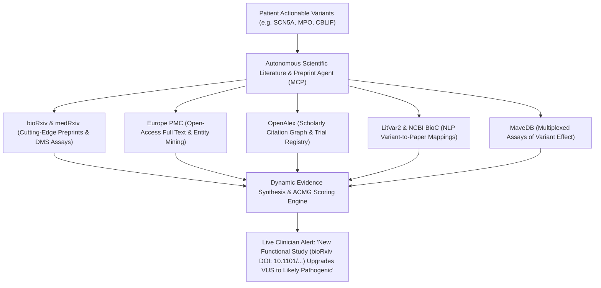
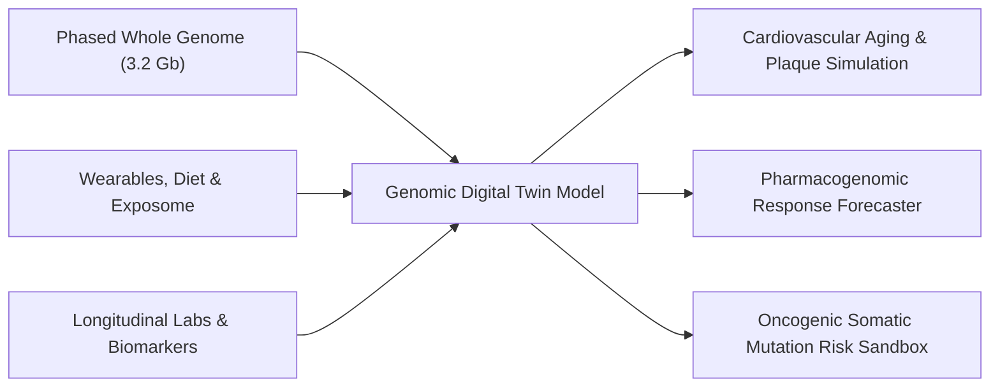
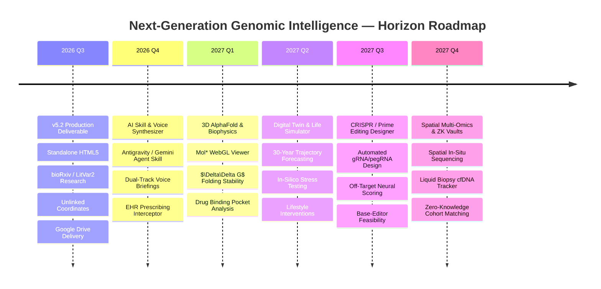

# Brainstorming & Transformative Opportunities: Thinking BIG in Precision Genomics, Real-Time Preprints & Autonomous AI (v5.2)

This document presents a comprehensive, visionary roadmap exploring the next evolutionary frontiers for the **Genomic Ontology Reporting Engine**. It outlines how emerging breakthroughs in generative AI, multimodal agents, molecular biophysics, live preprint networks (bioRxiv/medRxiv), spatial multi-omics, and gene editing can converge into an autonomous, proactive health intelligence ecosystem.

---

## 📚 1. Live Preprint Scanning & Real-Time Scientific Knowledgebases (bioRxiv, Europe PMC, OpenAlex)

### The Preprint Advantage in Precision Genomics
In clinical genomics and molecular biology, peer review cycles take 6 to 18 months. Critical breakthroughs—such as **Deep Mutational Scanning (DMS)**, high-throughput **CRISPR screens**, **AlphaFold 3 structural perturbations**, and **clinical trials**—are uploaded to **bioRxiv** and **medRxiv** long before appearing in traditional journals.

### High-Value Scientific Resources & MCP Integration Matrix

| Resource | Scope / Focus | Real-Time Value for Gene/Variant Reports | Query / Linking Format |
| :--- | :--- | :--- | :--- |
| **bioRxiv** | Biology & Molecular Genetics Preprints | Discovers newly published functional assays, saturation mutagenesis, and CRISPR rescue studies months ahead of journals. | `https://www.biorxiv.org/search/{gene}%20{rsid}` |
| **medRxiv** | Clinical Medicine & Epidemiology Preprints | Identifies novel patient cohort findings, rare disease case reports, and emerging therapeutic trials. | `https://www.medrxiv.org/search/{gene}%20{rsid}` |
| **Europe PMC** | 40M+ Full-Text Articles & Annotations | Deep entity extraction (NER) highlighting exact variant positions in methods, figures, and supplementary tables. | `https://europepmc.org/search?query={gene}%20AND%20{rsid}` |
| **OpenAlex** | Global Scholarly Knowledge Graph | Maps global author networks, institutional trials, and citation trajectories to score evidence reliability. | `https://openalex.org/works?search={gene}+{rsid}` |
| **LitVar2 (NCBI)** | Variant-Centric Literature NLP | Direct NCBI extraction linking dbSNP rsIDs to PubMed Central full-text papers. | `https://www.ncbi.nlm.nih.gov/research/litvar2/docsum?variant=litvar@{rsid}%23%23&query={rsid}` |
| **MaveDB** | Deep Mutational Scanning (DMS) | Experimental functional scores ($LOF$, $GOF$, neutral) for *every* possible amino acid swap across critical disease genes. | `https://www.mavedb.org/search/?q={gene}` |
| **ClinGen Knowledgebase** | NIH Expert Panel Curation | Gold-standard clinical gene-disease validity and dosage sensitivity classifications. | `https://search.clinicalgenome.org/kb/genes/{gene}` |
| **Open Targets Platform** | Drug Target Discovery & Validation | Comprehensive target tractability, small-molecule / antibody pipelines, and animal knockout phenotypes. | `https://platform.opentargets.org/target/{gene}` |

---

## 🌌 2. The Autonomous Genomic Digital Twin & Longitudinal Life Simulator

### Concept
Transform static whole-genome sequence data into a living, dynamic **In-Silico Digital Twin** that simulates a patient's molecular, physiological, and disease trajectories over a 50-year horizon.

### Key Innovations
* **Multi-Decade Disease Trajectory Simulation**:
  * Simulates how patient-specific polygenic risk (e.g. 87th percentile Coronary Artery Disease risk in *APOB*) interacts with environmental factors (LDL levels, smoking, blood pressure) over 10, 20, and 30-year spans.
* **In-Silico Pharmacological Stress-Testing**:
  * Before starting a new medication, clinicians simulate drug efficacy and toxic metabolite accumulation against the patient's exact hepatic cytochrome diplotypes (*CYP2D6*, *CYP2C19*, *SLCO1B1*).
* **Predictive Preventive Intervention Modeling**:
  * Quantifies exact risk reduction: e.g. *"Initiating PCSK9-inhibitor therapy at age 45 reduces lifetime myocardial infarction risk from 34% to 8%."*

---

## 🧬 3. In-Silico CRISPR / Prime Editing & Base Editing Therapeutic Designer

### Concept
For every pathogenic monogenic variant identified (e.g. *SCN5A* arrhythmia missense or *CBLIF* cobalamin defect), automatically design and validate personalized CRISPR/Cas9, Base Editing, and Prime Editing repair strategies in silico.

### Key Innovations
* **Automated gRNA & pegRNA Synthesis**:
  * Scans genomic flank ($\pm 100$ bp) for SpCas9, SaCas9, Cas12a, and engineered PAM motifs (e.g. SpG, SpRY).
  * Automatically synthesizes single-guide RNAs (sgRNAs) and prime editing guide RNAs (pegRNAs) with optimized reverse transcriptase templates.
* **Deep Learning Off-Target Risk Evaluation**:
  * Utilizes neural off-target predictors (CRISPR-Net / Cas-OFFinder) across the patient's whole genome to ensure zero unintended cleavage at homologous genomic sites.
* **Base-Editing Feasibility Engine**:
  * Evaluates whether Cytosine Base Editors (CBE: C$\rightarrow$T) or Adenine Base Editors (ABE: A$\rightarrow$G) can reverse pathogenic point mutations without inducing double-strand DNA breaks (DSBs).

---

## 🎙️ 4. Multimodal Voice AI Synthesizer & Spatial Holographic Explorer (WebXR / VisionOS)

### Concept
Enable clinicians and patients to interact with their genomic data through natural spoken dialogue and immersive spatial computing environments.

### Key Innovations
* **Bifurcated Voice AI Narrator**:
  * **Physician Mode**: High-density 3-minute executive clinical briefing utilizing formal ACMG nomenclature, detailing haplotype phasing, compound heterozygosity, and Tier 1 actionable recommendations.
  * **Patient Mode**: Conversational, jargon-free podcast summarizing inherited strengths (protective factors like *CCR5* / *MPO*) and actionable wellness steps in an empathetic tone.
* **Synchronized Waveform Navigation**:
  * Clicking or speaking about a gene in the audio player instantly flies the UI camera to that specific node in the 3D ontology tree or SVG locus track.
* **Spatial 3D Chromatin & Molecule Walking (WebXR / Apple Vision Pro)**:
  * Clinicians can walk inside a 3D rendering of the patient's nucleus, physically pulling apart chromosome territories, examining enhancer-promoter loops, and inspecting folded channel proteins in room-scale VR/AR.

---

## 🤖 5. Autonomous Genomic AI Skill (`genomics-ontology-skill`) & EHR Guardian

### Concept
Package the full reporting pipeline into an autonomous, proactive AI skill compatible with Google Antigravity, Gemini CLI, Claude MCP, and OpenAI tool systems that continuously safeguards patients inside hospital EHRs.

### Key Innovations
* **Real-Time Prescription Interceptor (EHR Guardian)**:
  * Plugs into hospital electronic health record systems (Epic / Cerner). Whenever a physician types a prescription order (e.g. Clopidogrel, Codeine, Warfarin, Simvastatin), the agent cross-checks the patient's genome in milliseconds and alerts the clinician if contraindicated.
* **Natural Language Semantic Phenotype Querying**:
  * Allows geneticists to execute complex queries:
    * `"Show all de novo missense variants in cardiac potassium channel complexes with CADD > 25, REVEL > 0.7, and LOEUF < 0.35."`
* **Automated 28-Criteria ACMG/AMP Re-Evaluation**:
  * Real-time automated scoring of all ACMG evidence codes (PVS1, PS1-4, PM1-6, PP1-5, BA1, BS1-4, BP1-7) with provenance citation tracking.

---

## 🔬 6. Interactive 3D Protein Structure & AlphaFold 3 Biophysical Perturbation

### Concept
Directly integrate live WebGL Mol* / 3Dmol.js viewers into gene and variant cards, projecting patient missense mutations onto AlphaFold 3-predicted multimers and channel complexes.

### Key Innovations
* **Thermodynamic $\Delta\Delta G$ Stability Prediction**:
  * In-browser calculation of protein folding free energy changes ($\Delta\Delta G$ in kcal/mol) caused by amino acid substitutions.
* **Electrostatic Surface Potential Mapping**:
  * Visualizes alterations in local charge distribution (red: acidic/negative, blue: basic/positive) to reveal disrupted active sites and phosphorylation pockets.
* **Drug-Binding Pocket Obstruction Analysis**:
  * Automatically determines whether a mutated residue lies within known small-molecule or biologics binding pockets.

---

## 🧪 7. Liquid Biopsy & Cell-Free DNA (cfDNA) Early Cancer Interception Tracker

### Concept
Integrate germline whole-genome sequence data with longitudinal cell-free DNA (cfDNA) and circulating tumor DNA (ctDNA) liquid biopsy assays for ultra-early multi-cancer detection.

### Key Innovations
* **Germline vs. Somatic Deconvolution**:
  * Uses the patient's baseline germline WGS as a high-fidelity reference to eliminate clonal hematopoiesis of indeterminate potential (CHIP) background noise from blood liquid biopsies.
* **Fragmentomics & Methylation Deconvolution**:
  * Analyzes cfDNA fragment length profiles and tumor-specific hypermethylation patterns to pinpoint the tissue of origin (e.g. colorectal, pancreatic, lung) years prior to radiographic detection.
* **Longitudinal Minimal Residual Disease (MRD) Dashboard**:
  * Tracks ctDNA variant allele fractions (VAF) over time following treatment to catch molecular recurrences at parts-per-million sensitivity.

---

## 🛡️ 8. Zero-Knowledge Cryptographic Genomic Sharing & Global Cohort Matching

### Concept
Enable patients to match with clinical trials and rare disease cohorts worldwide without ever exposing their raw DNA sequences to third parties.

### Key Innovations
* **ZK-SNARK Genomic Proofs**:
  * Patients generate zero-knowledge mathematical proofs: e.g. *"I possess a verified pathogenic variant in SCN5A and an HPO phenotype matching Long QT syndrome, without revealing my genome or identity."*
* **Homomorphic Encrypted Trial Matching**:
  * Pharmaceutical sponsors run encrypted trial matching algorithms against decentralized patient data vaults without decryption.
* **Sovereign Genomic Data Ownership**:
  * Patients retain complete cryptographic control over their genomic keys, granting time-limited, verifiable consent for research studies.

---

## 🗺️ Master Strategic Roadmap

