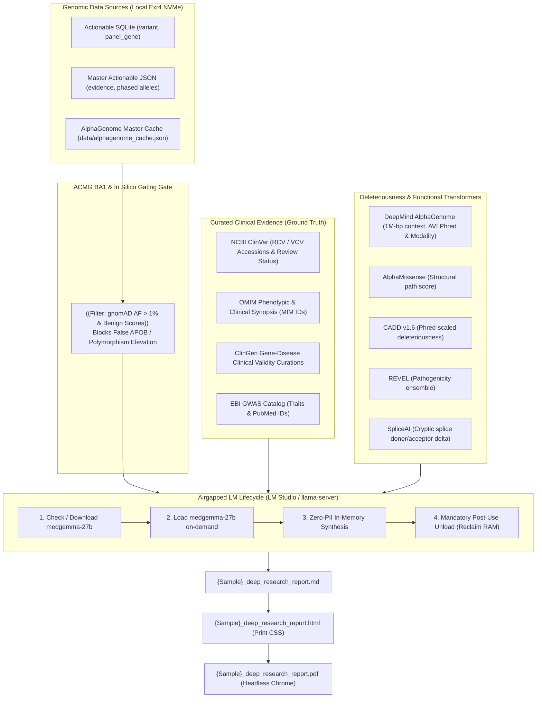

# Deep Genomic Research & Evidence Synthesis Skill

This skill governs the automated generation of concise, high-yield, 1-to-4 page Clinical Genomics Evidence Synthesis Reports for whole-genome sequencing (WGS) cohorts. It establishes an evidence reconciliation framework that cross-references monogenic disease databases with deep-learning biological foundation models to produce actionable clinical dossiers without factual extrapolation.

---

## 1. Non-Negotiable Directives: Privacy, Local Isolation & Zero Fabrication

All agents and programs executing under this skill must adhere to the following strict boundaries:

1. **Air-Gapped Local Model Execution Only:**
   * Any AI model invocation must strictly target local inference engines running on `localhost` using **`medgemma-1.5-4b-it` (Multimodal with `mmproj-F32.gguf`)** or **`medgemma-27b`** (e.g. via llama-server router on `http://127.0.0.1:7002` or LM Studio on `http://127.0.0.1:1234`).
   * **Multimodal Engine Support:** `medgemma-1.5-4b-it` is the designated fast (~18-60 tokens/s), low-memory (~4GB) multimodal model equipped with medical vision projector (`mmproj-F32.gguf`) for joint analysis of clinical genomics, MRI/CT neuroimaging, echocardiograms, and genomic tracks. `medgemma-27b` serves as the high-parameter textual reasoning engine.
   * **Absolute Network Egress Prohibition:** No prompt containing sample identifiers, real names, or raw identifiable callsets may be transmitted to external cloud LLMs or remote internet endpoints.
2. **Local Model Lifecycle Management (Existence, Loading & Unloading):**
   * **Existence Check:** The runner checks for `medgemma-1.5-4b-it-Q8_0.gguf` + `mmproj-F32.gguf` (in `~/.lmstudio/models/unsloth/medgemma-1.5-4b-it-GGUF/`) and `medgemma-27b-text-it-Q4_K_M.gguf` (in `~/.lmstudio/models/lmstudio-community/`).
   * **Load On-Demand:** The model is launched with Vulkan/AVX2 acceleration and up to 16,384 token context window.
   * **Mandatory Unload Post-Use:** Immediately after synthesis completion, the server process must be terminated to reclaim RAM/VRAM for high-throughput WGS bioinformatics pipelines.
3. **Strict Zero PII / PHI Transmission & Genomic Privacy Broker (Chaffing & Winnowing):**
   * **Zero Identity Knowledge:** External models and AI assistants must remain completely blind to real patient names, sample IDs (e.g. `DE`, `ME`), and local user filesystem paths (`/home/daniel-ehrle/...`).
   * **Genomic Differential Privacy (Chaffing & Winnowing):** To prevent genomic re-identification attacks when interacting with cloud or distributed agents, the `GenomicPrivacyBroker` (`lib/genomic_privacy_broker.py`) injects realistic decoy SNVs (chaff) with local cryptographic HMAC signatures, partitions variants into orthogonal blocks, and winnows/discards decoys locally before reassembling the genuine report.
   * **Public Benchmark Testing Only:** All developer pipeline testing, prompt validation, and automated testing by AI assistants must strictly execute on public reference standards (e.g. **GIAB HG002 / HG003** in `/data/Genomes/HG002/`). Agents are strictly forbidden from inspecting, querying, or reporting on private family callsets (`DE`, `ME`).
4. **ACMG BA1 Stand-Alone Benign & Synonymous Gating (Anti-False Reporting Guardrail):**
   * Any variant with population allele frequency $> 1.0\%$ in gnomAD (`gnomad4_af > 0.01`) or in silico consensus of neutrality ($\text{CADD} < 15.0$, $\text{REVEL} < 0.25$, AlphaMissense `likely_benign`) is **strictly disqualified from being elevated as a Primary Finding, pathogenic driver, or protective contraindication** (e.g. preventing false reporting of *APOB* `p.Ala4481Thr`).
   * **Synonymous Variant Filter:** Silent synonymous variants (`so == "SYN"`) without severe splice alteration (`SpliceAI < 0.2`) are strictly gated from primary findings and pharmacogenomic contraindication dossiers (e.g. preventing false lomitapide contraindications for benign synonymous *APOB* `p.Leu1060=`).
   * Gene-level ClinGen "Definitive" assertions cannot elevate a variant whose ClinVar classification is `Conflicting` or `VUS`.
5. **Zero Invention / Zero Factual Extrapolation (Strict Grounding):**
   * The model and report generator are strictly prohibited from inventing, extrapolating, or hallucinating variants, gene associations, clinical recommendations, or pharmacological indications.
   * Every statement in the report must map directly to supplied data (exact ClinVar accession numbers `RCV`/`VCV`, OMIM morbid IDs, CPIC guidelines, or published PMIDs).
6. **Mandatory Calculated Numerical Confidence Scores in Tables (0.00–1.00):**
   * Tables (Primary Findings, Cardiovascular/Hematologic Surveillance, and Clinical Decision Calculus) must include an explicit **Calculated Confidence** column.
   * Confidence scores must be objectively calculated based on orthogonal evidence: ClinVar review stars, CPIC level, in silico deleteriousness consensus (CADD >= 20, REVEL >= 0.5, AlphaGenome AVI), and 40x WGS sequencing depth/allelic balance.
7. **Strict Grounding: Exact Callset Variant Match Across ALL Pipeline Models (Especially QwQ-32B & Mistral-Small 24B):**
   * **Universal Callset Grounding Across All Models:** The requirement of an exact variant match with the source JSON callset (`{sample}_master_actionable.json`) applies strictly to ALL models in the multi-model pipeline: Gemma 2B (Router/Supervisor), MedGemma 27B (Track 1A & 2B), Bio-Medical-Llama 8B (Track 1B), Baichuan-M2 32B (Track 2A), and most critically the final two models in the pipeline:
     1. **QwQ-32B (Adversarial Review & Adjudication Engine):** Must adversarially audit and reject any variant not present in the source JSON callset. Every entry in the adjudicated JSON payload (`primary_genomic_findings`, `secondary_modifiers`, `pharmacogenomic_directives`, `decision_calculus`) must match a source JSON record verbatim (exact gene, HGVS `c.` and `p.`, rsID, and coordinates).
     2. **Mistral-Small 3.2 24B (Publication Report Writer):** Must restrict report synthesis strictly to the exact variants present in the source callset. Under no circumstances may it introduce uncalled variants, unlisted alleles, phantom genes, or extrapolate ungrounded disease mechanisms.
   * **Exact Nomenclature & Metadata Match:** Every gene symbol, HGVS notation (`c.` and `p.`), dbSNP rsID, and genomic coordinate referenced anywhere in model outputs, tables, dossiers, surveillance sections, narrative, and appendices must match the source JSON callset verbatim.
   * **Multi-Allelic Gene Disambiguation (e.g. F5):** When a proband carries multiple distinct variants in the same gene (such as *F5* carrying both *p.Thr295Ala* rs371760153 and *p.Arg534Gln* rs6025), BOTH variants must be explicitly identified and listed in the appropriate tables with their exact protein changes, rsIDs, and coordinates. Reports must never mention a variant in narrative without tabulating it, nor conflate their clinical mechanisms.
   * **Automated Two-Stage Programmatic Validation:**
     - Stage 1 (Adjudication Audit): Programmatically audits the QwQ-32B JSON payload against the source callset, instantly purging any ungrounded variants or hallucinated alleles.
     - Stage 2 (Synthesis Audit): Programmatically audits the final Markdown report to verify that every variant discussed or tabulated matches the source JSON callset with zero extraneous alleles.
8. **Clean Slate Memory Purge & Pre-Execution Archival Directive (Zero Cross-Contamination):**
   * **Mandatory Memory & Cache Purge Prior to Run:** At the start of every synthesis run, all running local inference server instances must be forcefully terminated, KV-caches wiped clean, memory unmapped from host RAM, and stale `/tmp/llama_server_*.log` files purged so that no residual context or prompt tokens linger between runs.
   * **Artifact Archival:** Prior synthesis reports (`*.md`, `*.html`, `*.pdf`, `*_adjudicated.json`) must be archived into a timestamped directory inside `archive/` prior to execution.
   * **Zero Retrospective Cross-Contamination:** The pipeline and report generation engines are strictly prohibited from ingesting, reading, or referencing prior synthesis runs, draft files, or conversational memory. Fresh synthesis must derive exclusively and cleanly from the verified primary `{sample}_master_actionable.json` dataset.
   * **Active Resident Router & Supervisor:** The local Google Gemma 2B model (`gemma-2b`) operates resident on port 7005 as the active pipeline supervisor and routing auditor.

---

## 2. Architectural Overview & Evidence Stack

The synthesis engine bridges primary callsets with curated scientific databases and deep neural transformer scores:



---

## 3. Universal Trait-Driven Evidence Triage

All variants are evaluated and prioritized using principled, domain-agnostic criteria without bespoke gene-specific branching:

### Category 1: Primary Monogenic & Clinically Actionable Findings
* **Inclusion Criteria:**
  1. ClinVar status `Pathogenic` or `Likely Pathogenic` without conflicting/uncertain submissions in a coding- or splice-altering variant with gnomAD $\text{AF} \le 0.01$.
  2. ClinGen `Definitive` variants with high-penetrance pharmacogenomic contraindications or thrombophilia risks (e.g. *F5* Factor V Leiden).
  3. Disqualified: Any variant with gnomAD $\text{AF} > 1.0\%$ or in silico benign concordance is pruned from Category 1.
* **Clinical Reporting:** Structured narrative Evidence Dossier detailing molecular consequence, multi-engine in silico consensus (CADD, REVEL, AlphaMissense, AlphaGenome AVI score/modality/percentile), ClinGen validity, OMIM phenotypic mappings, and actionable surveillance/contraindication guidance.

### Category 2: Cardiovascular, Channelopathy & Hematology Surveillance
* **Inclusion Criteria:** Actionable Tier 1/2 variants in genes with cardiovascular, arrhythmia, lipid transport, or coagulation terms in Gene Ontology (`gene_go_bpo`) or Human Phenotype Ontology (`gene_hpo_term`).
* **Clinical Reporting:** Tabulated summary detailing arrhythmia/thrombophilia risk, REVEL/AlphaMissense scores, and driving AlphaGenome modalities (*Splicing*, *Cactus*, *AlphaMissense*).

### Category 3: Metabolic, Mitochondrial & DNA Repair Co-Factors
* **Inclusion Criteria:** Nuclear genes governing mitochondrial maintenance, transsulfuration/amino acid metabolism, or DNA repair machinery dynamically identified from ontology annotations.

### Category 4: Protective Alleles & Critical Pharmacogenomic Contraindications
* **Inclusion Criteria:**
  1. **Protective / Longevity Trait Mining:** Rare variants ($\text{AF} \le 0.005$) tagged with `protective`, `hypobetalipoproteinemia`, `hypocholesterolemia`, `longevity`, or `reduced risk` across ClinVar significance and GWAS.
  2. **Pharmacogenomic & Contraindication Discovery:** Variants tagged with `drug response`, `pharmacogenomic`, `toxicity`, `contraindicated`, or specific drug classes in ClinVar, PharmGKB, CPIC, or clinical synopses.
* **Mandatory High-Impact Pharmacogenomic Directives:**
  - **POLG Variants:** If *POLG* is present (e.g. `p.Gly737Arg`), the report **must prominently mandate an absolute, life-saving contraindication against sodium valproate (Depakote/valproic acid)** due to the extreme risk of fatal acute hepatic failure in POLG carriers, alongside warnings for mitochondrial-toxic medications and general anesthetics.
  - **DPYD Variants:** If *DPYD* is present (e.g. `p.Val732Ile`), detail fluoropyrimidine (5-FU, capecitabine) catabolism deficiency and CPIC-guided dosing reductions or alternative therapy.
  - **F5 Variants:** If *F5* is present, detail resistance to activated protein C (APC) and situational thromboprophylaxis guidelines during surgery, immobilization, or estrogen therapy.
  - **ANK2 Variants:** If *ANK2* is present, detail cardiac conduction vigilance, torsadogenic drug cautions, and cross-reference the CredibleMeds QT-prolonging drug lists.
  - **Sequencing Modality:** The sequencing modality is **strictly 40x Whole-Genome Sequencing (WGS)** on GRCh38. Reports and models must **never** refer to Whole-Exome Sequencing (WES).

---

## 4. Mandatory Soft Template Flow & VSCP-DF Standards

The reporting suite produces two synchronized clinical deliverables plus a structured EHR import dataset:

### Deliverable 1: 3-Page Clinician Action Brief (`{Sample}_clinical_brief.html`)
Designed specifically for sharing with physicians, clinical geneticists, and uploading into patient EHR records:
* **Page 1 (The Bottom Line):**
  - Priority Genomic Findings table (*CBLIF*, *GJB2*, *VDR*, *F5*, *ANK2*).
  - Actionable Pharmacogenomic Prescribing Guardrails (*DPYD*, *NAT2*, *VKORC1*, *CYP2C9*).
* **Page 2 (Surveillance & Decision Calculus):**
  - Suggested Clinical & Laboratory Surveillance Schedule (frequencies and actionable thresholds).
  - Balanced arguments FOR and AGAINST clinical interventions (gentle guidance, non-prescriptive).
  - Calculated Evidence Confidence Metrics (0–100%).
* **Page 3 (Digital Navigation & EHR Note):**
  - Direct links to local interactive reports (`master_ontology_report.html`) and external repositories.
  - EHR Problem List / Consultation Note block ready for direct EHR chart integration.

### Deliverable 2: Deep Research Dossier (`{Sample}_deep_research_report.md` / `.html`)
Comprehensive research synthesis formatted with strict polarity segregation and enhanced ergonomics:
* **No Table of Contents:** Direct entry into content starting with Sentence 1.
* **No Upfront 3D Viewer Link:** Clean academic layout without distractions.
* **Section 7 (Confidence Assessment):** Formatted with confidence levels and explanatory text on **separate lines**:
  ```markdown
  ##### Analytical Callset Confidence
  **98%**
  High-depth 40x WGS callset aligned against panSN GBZ pan-genome graph...
  ```
* **Landscape Grouped Variant Catalog:** The multi-page catalog of prioritized variants is collapsed into distinct functional/clinical groupings:
  1. *Pathogenic & Monogenic Carriers*
  2. *Actionable Pharmacogenomics & Drug Response*
  3. *Cardiovascular & Channelopathy Modifiers*
  4. *Metabolic, Mitochondrial & DNA Repair Machinery*
  5. *Protective & Longevity Modifiers*
  6. *Secondary & Exploratory Clinical Variants*
  - In print and PDF rendering, each grouping features a page break before the section with layout oriented in **landscape**.

### Deliverable 3: Patient Self-Reported EHR Import JSON (`{Sample}_ehr_import.json`)
A standards-compliant FHIR-aligned JSON bundle designed for EHR and patient portal ingestion containing:
* Patient self-reported metadata and non-clinical WGS analysis flags.
* Prioritized genomic alerts with HGVS notation, coordinates, zygosity, and ClinVar VCV accessions.
* Actionable pharmacogenomic prescribing alerts with CPIC level indications.
* Multi-system organ risk matrix summary and polygenic risk scores.

---

## 5. End-to-End Automated Pipeline Flow

The end-to-end execution flow executes across 6 deterministic stages:
```mermaid
flowchart TD
    [=Master JSON + Pharma + AlphaGenome=] --> ((Stage 1: Ingestion))
    ((Stage 1: Ingestion)) --> ((Stage 2: Local PII Stripping))
    ((Stage 2: Local PII Stripping)) --> [=Sanitized Zero-PII JSON=]
    [=Sanitized Zero-PII JSON=] --> ((Stage 3: Gemini Fast High Synthesis))
    ((Stage 3: Gemini Fast High Synthesis)) --> [=Sanitized Templates Alt B & C=]
    [=Sanitized Templates Alt B & C=] --> ((Stage 4: MedGemma Local PII Binding))
    ((Stage 4: MedGemma Local PII Binding)) --> [=Personalized Deliverables=]
    ((Stage 4: MedGemma Local PII Binding)) --> ((Stage 5: Unload Local AI & Free RAM))
    [=Personalized Deliverables=] --> ((Stage 6: Google Drive Sync))
    ((Stage 6: Google Drive Sync)) --> [=Google Drive / Ontology /=]
```

1. **Stage 1 (Ingestion):** Local AI loads master JSON (`{Sample}_ontology_pharma_alphagenome.json`) containing complete open-cravat annotations, CPIC interactions, and AlphaGenome Atlas predictions.
2. **Stage 2 (Local PII Stripping):** Programmatically scrubs all patient names, sample identifiers, and filesystem paths, producing zero-PII `proband_01_ontology_pharma_alphagenome.json`.
3. **Stage 3 (Model Synthesis):** Synthesizes the Clinician Brief, Deep Dossier, and EHR Import JSON enforcing exact variant matching and strict validation templates.
4. **Stage 4 (Local PII Binding):** Local MedGemma binds real patient name and sample IDs into deliverables entirely on localhost.
5. **Stage 5 (Memory Reclamation):** Forcefully unloads local inference processes (`pkill -f llama-server.*7002`) and flushes RAM.
6. **Stage 6 (Google Drive Sync):** Copies final personalized deliverables to Google Drive `Ontology/` root and dated run folder.

---

## 6. Execution Script

Run the automated flow via:
```bash
python3 generate_flow_pipeline.py \
  --sample-id Daniel_Ehrle-07-10-2026 \
  --patient-name "Daniel Ehrle" \
  --patient-id "Daniel_Ehrle"
```

