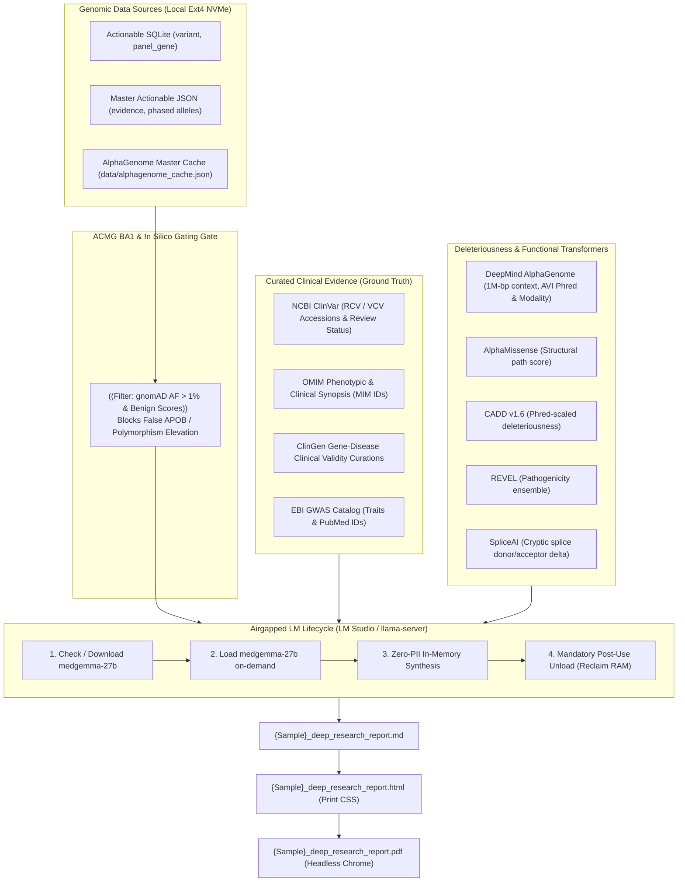

# Deep Genomic Research & Evidence Synthesis Skill

This skill governs the automated generation of concise, high-yield, 1-to-4 page Clinical Genomics Evidence Synthesis Reports for whole-genome sequencing (WGS) cohorts. It establishes an evidence reconciliation framework that cross-references monogenic disease databases with deep-learning biological foundation models to produce actionable clinical dossiers without factual extrapolation.

---

## 1. Non-Negotiable Directives: Privacy, Local Isolation & Zero Fabrication

All agents and programs executing under this skill must adhere to the following strict boundaries:

1. **Air-Gapped Local Model Execution Only:**
   * Any AI model invocation must strictly target local inference engines running on `localhost` using **`medgemma-27b`** (e.g. via LM Studio on `http://127.0.0.1:1234` or llama-server router on `http://127.0.0.1:8080` / `7002`).
   * **Absolute Network Egress Prohibition:** No prompt containing sample identifiers, genotypes, phenotypes, or clinical dossiers may be transmitted to external cloud LLMs or remote internet endpoints.
2. **Local Model Lifecycle Management (Existence, Loading & Unloading):**
   * **Existence Check:** The runner must verify that `medgemma-27b` exists locally on the machine (e.g. in LM Studio directory `~/.lmstudio/models/lmstudio-community/medgemma-27b-text-it-GGUF/medgemma-27b-text-it-Q4_K_M.gguf` or `/home/daniel-ehrle/ai-infrastructure/models/medgemma-27b-it.gguf`).
   * **Automated Download:** If the model is absent, it must be downloaded via `lms get` or `curl` from Hugging Face before proceeding.
   * **Load On-Demand:** The model should be loaded into memory for the active inference session (e.g. `lms load medgemma-27b` or llama-server dynamic context allocation).
   * **Mandatory Unload Post-Use:** Immediately after synthesis completion, the model **must be unloaded** (e.g. `lms unload medgemma-27b` or stopping the inference server) to reclaim the 32GB RAM/GPU slice and prevent I/O memory contention with the WGS genomics pipeline.
3. **Strict Zero PII / PHI Transmission & Sanitization:**
   * Direct identifiers (patient full names, dates of birth, geographic locations, medical record numbers, system user home paths like `/home/daniel-ehrle/...`) must be completely scrubbed before model reasoning or report staging.
   * Internal pipelines must use de-identified cohort/session tokens (e.g., `SUBJECT_PROBAND_01`) or sample aliases (`SAMPLE_DE`) without linking personal demographics.
4. **ACMG BA1 Stand-Alone Benign Gating (Anti-False Reporting Guardrail):**
   * Any variant with population allele frequency $> 1.0\%$ in gnomAD (`gnomad4_af > 0.01`) or in silico consensus of neutrality ($\text{CADD} < 15.0$, $\text{REVEL} < 0.25$, AlphaMissense `likely_benign`) is **strictly disqualified from being elevated as a Primary Finding, pathogenic driver, or protective contraindication** (e.g. preventing false reporting of *APOB* `p.Ala4481Thr` or *APOB* `p.Leu1060=`).
   * Gene-level ClinGen "Definitive" assertions cannot elevate a variant whose ClinVar classification is `Conflicting` or `VUS`.
5. **Zero Invention / Zero Factual Extrapolation (Strict Grounding):**
   * The model and report generator are strictly prohibited from inventing, extrapolating, or hallucinating variants, gene associations, clinical recommendations, or pharmacological indications.
   * Every statement in the report must map directly to supplied data (exact ClinVar accession numbers `RCV`/`VCV`, OMIM morbid IDs, CPIC guidelines, or published PMIDs).
6. **Mandatory Numerical Confidence Scores (0.00–1.00):**
   * Every diagnostic, prognostic, and pharmacogenomic section must include an explicit numerical confidence score calibrated against data completeness, sequencing depth (40x WGS short-read constraints), and curation concordance.

---

## 2. Architectural Overview & Evidence Stack

The synthesis engine bridges primary callsets with curated scientific databases and deep neural transformer scores:



---

## 3. Universal Trait-Driven Evidence Triage

All variants are evaluated and prioritized using principled, domain-agnostic criteria without bespoke gene-specific branching:

### Category 1: Primary Monogenic & Clinically Actionable Findings
* **Inclusion Criteria:**
  1. ClinVar status `Pathogenic` or `Likely Pathogenic` without conflicting/uncertain submissions in a coding- or splice-altering variant with gnomAD $\text{AF} \le 0.01$.
  2. ClinGen `Definitive` variants with high-penetrance pharmacogenomic contraindications or thrombophilia risks (e.g. *F5* Factor V Leiden).
  3. Disqualified: Any variant with gnomAD $\text{AF} > 1.0\%$ or in silico benign concordance is pruned from Category 1.
* **Clinical Reporting:** Structured narrative Evidence Dossier detailing molecular consequence, multi-engine in silico consensus (CADD, REVEL, AlphaMissense, AlphaGenome AVI score/modality/percentile), ClinGen validity, OMIM phenotypic mappings, and actionable surveillance/contraindication guidance.

### Category 2: Cardiovascular, Channelopathy & Hematology Surveillance
* **Inclusion Criteria:** Actionable Tier 1/2 variants in genes with cardiovascular, arrhythmia, lipid transport, or coagulation terms in Gene Ontology (`gene_go_bpo`) or Human Phenotype Ontology (`gene_hpo_term`).
* **Clinical Reporting:** Tabulated summary detailing arrhythmia/thrombophilia risk, REVEL/AlphaMissense scores, and driving AlphaGenome modalities (*Splicing*, *Cactus*, *AlphaMissense*).

### Category 3: Metabolic, Mitochondrial & DNA Repair Co-Factors
* **Inclusion Criteria:** Nuclear genes governing mitochondrial maintenance, transsulfuration/amino acid metabolism, or DNA repair machinery dynamically identified from ontology annotations.

### Category 4: Protective Alleles & Pharmacogenomic Contraindications
* **Inclusion Criteria:**
  1. **Protective / Longevity Trait Mining:** Rare variants ($\text{AF} \le 0.005$) tagged with `protective`, `hypobetalipoproteinemia`, `hypocholesterolemia`, `longevity`, or `reduced risk` across ClinVar significance and GWAS.
  2. **Pharmacogenomic & Contraindication Discovery:** Variants tagged with `drug response`, `pharmacogenomic`, `toxicity`, `contraindicated`, or specific drug classes (valproate, fluoropyrimidines, arylamines) in ClinVar, PharmGKB, or clinical synopses.
* **Clinical Reporting:** Structured guidance defining the biological resistance mechanism, exact clinical contraindications against adverse medications or overtreatment, and tailored laboratory surveillance.

---

## 4. Mandatory VSCP-DF Structure, Limitations & Page Budget Constraints

The synthesis report must strictly observe the **Visual-Structural Cognitive Profile & Decision Framework (VSCP-DF)**:
1. **Length Constraint:** Exactly **1 to 4 printed pages** (rendered via `@media print` CSS in HTML and verified in vector PDF).
2. **Immediate Sentence-1 Content Delivery:** Zero conversational preambles, introductory filler, or flattering remarks.
3. **Four-Part Document Structure:**
   * `### Orientation: What We Are Covering` (Scope, sample ID, total variant counts by tier, reference build GRCh38).
   * `### Body` (Yourdon-style information flow diagram, prioritized comparison tables, narrative evidence dossiers for primary findings).
   * `### Conclusions: Diagnostic & Clinical Decision Calculus`:
     * `#### Arguments FOR Clinical Surveillance & Actionable Prophylaxis` (Actionable monogenic findings, critical pharmacogenomics, multi-model consensus).
     * `#### Arguments AGAINST Aggressive Over-Intervention & Report Limitations` (Autosomal recessive carrier asymptomacy, VUS non-actionability, paralogy/pseudogene representational artifacts, 40x short-read WGS detection limits).
     * `#### Patient Profile & Methodological Assumptions` (Documenting patient-specific directives: mosaicism/heteroplasmy expectations, annual re-analysis, pedigree phasing anchors, pan-genome GBZ mapping, and gVCF boundaries).
   * `### Opportunities: High-Yield Clinical Next Steps` (Actionable laboratory tests, EHR contraindication alerts, surveillance imaging, annual re-analysis cadence).
4. **Structured Confidence & Uncertainty Assessment:** Numerical score (0.00–1.00) accompanied by key assumptions and sequencing technology limitations (short-read 40x WGS boundaries).

---

## 5. Execution & Pipeline Integration

### Standalone CLI Execution
```bash
python3 lib/generate_deep_research_report.py \
  --sqlite reports/{SAMPLE_DIR}/{SAMPLE}_master_actionable.sqlite \
  --act-json reports/{SAMPLE_DIR}/{SAMPLE}_master_actionable.json \
  --ag-cache reports/{SAMPLE_DIR}/{SAMPLE}_alphagenome_cache.json \
  --out-dir reports/{SAMPLE_DIR} \
  --sample-name "{SAMPLE_NAME}" \
  --patient-id "{SAMPLE_ID}"
```

### Pipeline Stage 7.2 Integration
Executed automatically in `run_ontology_pipeline.py` after Stage 7.1 AlphaGenome TSV export:
* Validates local `medgemma-27b` availability and manages runtime lifecycle (load on-demand $\rightarrow$ synthesize $\rightarrow$ unload).
* Generates `{Sample}_deep_research_report.md` with ACMG BA1 false-reporting gates.
* Renders print-optimized `{Sample}_deep_research_report.html`.
* Compiles vector `{Sample}_deep_research_report.pdf` via headless Chrome/Chromium.
* Packages all three deliverables into `{Sample}_iOS_bundle.zip`.
