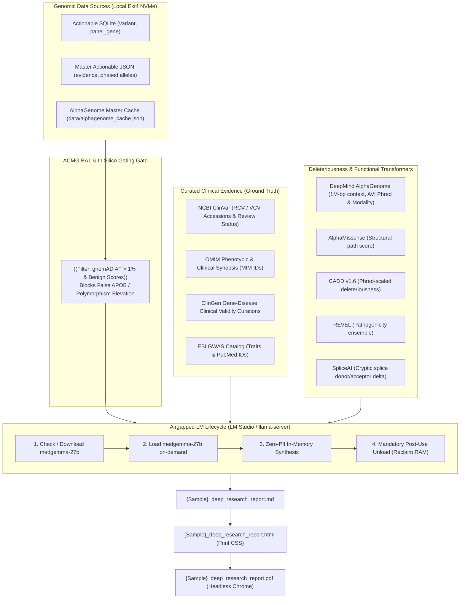

# Deep Genomic Research & Evidence Synthesis Skill

This skill governs the automated generation of concise, high-yield, 1-to-4 page Clinical Genomics Evidence Synthesis Reports for whole-genome sequencing (WGS) cohorts. It establishes an evidence reconciliation framework that cross-references monogenic disease databases with deep-learning biological foundation models to produce actionable clinical dossiers without factual extrapolation.

---

## 1. Non-Negotiable Directives: Privacy, Local Isolation & Zero Fabrication

All agents and programs executing under this skill must adhere to the following strict boundaries:

1. **Air-Gapped Local Model Execution Only:**
   * Any AI model invocation must strictly target local inference engines running on `localhost` using **`medgemma-1.5-4b-it` (Multimodal with `mmproj-F32.gguf`)** or **`medgemma-27b`** (e.g. via llama-server router on `http://127.0.0.1:7002` or LM Studio on `http://127.0.0.1:1234`).
   * **Multimodal Engine Support:** `medgemma-1.5-4b-it` is the designated fast (~18-60 tokens/s), low-memory (~4GB) multimodal model equipped with medical vision projector (`mmproj-F32.gguf`) for joint analysis of clinical genomics, MRI/CT neuroimaging, echocardiograms, and genomic tracks. `medgemma-27b` serves as the high-parameter textual reasoning engine.
   * **Absolute Network Egress Prohibition:** No prompt containing sample identifiers, real names, or raw identifiable callsets may be transmitted to external cloud LLMs or remote internet endpoints.
2. **Local Model Lifecycle Management (Existence, Loading & Unloading):**
   * **Existence Check:** The runner checks for `medgemma-1.5-4b-it-Q8_0.gguf` + `mmproj-F32.gguf` (in `~/.lmstudio/models/unsloth/medgemma-1.5-4b-it-GGUF/`) and `medgemma-27b-text-it-Q4_K_M.gguf` (in `~/.lmstudio/models/lmstudio-community/`).
   * **Load On-Demand:** The model is launched with Vulkan/AVX2 acceleration and up to 16,384 token context window.
   * **Mandatory Unload Post-Use:** Immediately after synthesis completion, the server process must be terminated to reclaim RAM/VRAM for high-throughput WGS bioinformatics pipelines.
3. **Strict Zero PII / PHI Transmission & Genomic Privacy Broker (Chaffing & Winnowing):**
   * **Zero Identity Knowledge:** External models and AI assistants must remain completely blind to real patient names, sample IDs (e.g. `DE`, `ME`), and local user filesystem paths (`/home/daniel-ehrle/...`).
   * **Genomic Differential Privacy (Chaffing & Winnowing):** To prevent genomic re-identification attacks when interacting with cloud or distributed agents, the `GenomicPrivacyBroker` (`lib/genomic_privacy_broker.py`) injects realistic decoy SNVs (chaff) with local cryptographic HMAC signatures, partitions variants into orthogonal blocks, and winnows/discards decoys locally before reassembling the genuine report.
   * **Public Benchmark Testing Only:** All developer pipeline testing, prompt validation, and automated testing by AI assistants must strictly execute on public reference standards (e.g. **GIAB HG002 / HG003** in `/data/Genomes/HG002/`). Agents are strictly forbidden from inspecting, querying, or reporting on private family callsets (`DE`, `ME`).
4. **ACMG BA1 Stand-Alone Benign & Synonymous Gating (Anti-False Reporting Guardrail):**
   * Any variant with population allele frequency $> 1.0\%$ in gnomAD (`gnomad4_af > 0.01`) or in silico consensus of neutrality ($\text{CADD} < 15.0$, $\text{REVEL} < 0.25$, AlphaMissense `likely_benign`) is **strictly disqualified from being elevated as a Primary Finding, pathogenic driver, or protective contraindication** (e.g. preventing false reporting of *APOB* `p.Ala4481Thr`).
   * **Synonymous Variant Filter:** Silent synonymous variants (`so == "SYN"`) without severe splice alteration (`SpliceAI < 0.2`) are strictly gated from primary findings and pharmacogenomic contraindication dossiers (e.g. preventing false lomitapide contraindications for benign synonymous *APOB* `p.Leu1060=`).
   * Gene-level ClinGen "Definitive" assertions cannot elevate a variant whose ClinVar classification is `Conflicting` or `VUS`.
5. **Zero Invention / Zero Factual Extrapolation (Strict Grounding):**
   * The model and report generator are strictly prohibited from inventing, extrapolating, or hallucinating variants, gene associations, clinical recommendations, or pharmacological indications.
   * Every statement in the report must map directly to supplied data (exact ClinVar accession numbers `RCV`/`VCV`, OMIM morbid IDs, CPIC guidelines, or published PMIDs).
6. **Mandatory Numerical Confidence Scores (0.00–1.00):**
   * Every diagnostic, prognostic, and pharmacogenomic section must include an explicit numerical confidence score calibrated against data completeness, sequencing depth (40x WGS short-read constraints), and curation concordance.
7. **Mandatory Variant Identity & Table-Narrative Concordance Guardrail (Anti-Conflation):**
   * **Multi-Allelic Gene Disambiguation:** When a proband carries multiple distinct variants in the same gene (e.g. *F5* Leiden `p.Arg534Gln` / `rs6025` vs. *F5* deficiency VUS `p.Thr295Ala` / `rs371760153`), each variant must be strictly disambiguated by explicit protein change and rsID.
   * **Table-Narrative Concordance:** The exact variant displayed in evidence tables MUST strictly match the specific variant analyzed in the accompanying clinical narrative, decision calculus, and EHR directives. Reports must **never** list one variant in a table while attaching the clinical actions, mechanisms, or contraindications of a different variant.
   * **Automated Post-Synthesis Validation:** All generated reports must undergo automated concordance checks verifying that every variant mentioned in a table has consistent narrative representation and no cross-wired alleles.
8. **Clean Slate Memory Purge & Pre-Execution Archival Directive:**
   * **Model Memory & KV-Cache Purge:** At the start of every sample synthesis run, all running local inference server instances must be terminated and memory fully unmapped so that no residual prompt tokens or KV-cache history linger between probands or pipeline runs.
   * **Artifact Archival:** Prior synthesis reports (`*.md`, `*.html`, `*.pdf`, `*_adjudicated.json`) must be archived into a timestamped directory inside `archive/` prior to execution.
   * **Zero Retrospective Cross-Contamination:** The pipeline and report generation engines are strictly prohibited from ingesting, reading, or referencing prior synthesis runs, draft files, or conversational memory. Fresh synthesis must derive exclusively and cleanly from the verified primary `{sample}_master_actionable.json` dataset.
   * **Active Resident Router & Supervisor:** The local Google Gemma 2B model (`gemma-2b`) operates resident on port 7005 as the active pipeline supervisor and routing auditor.

---

## 2. Architectural Overview & Evidence Stack

The synthesis engine bridges primary callsets with curated scientific databases and deep neural transformer scores:



---

## 3. Universal Trait-Driven Evidence Triage

All variants are evaluated and prioritized using principled, domain-agnostic criteria without bespoke gene-specific branching:

### Category 1: Primary Monogenic & Clinically Actionable Findings
* **Inclusion Criteria:**
  1. ClinVar status `Pathogenic` or `Likely Pathogenic` without conflicting/uncertain submissions in a coding- or splice-altering variant with gnomAD $\text{AF} \le 0.01$.
  2. ClinGen `Definitive` variants with high-penetrance pharmacogenomic contraindications or thrombophilia risks (e.g. *F5* Factor V Leiden).
  3. Disqualified: Any variant with gnomAD $\text{AF} > 1.0\%$ or in silico benign concordance is pruned from Category 1.
* **Clinical Reporting:** Structured narrative Evidence Dossier detailing molecular consequence, multi-engine in silico consensus (CADD, REVEL, AlphaMissense, AlphaGenome AVI score/modality/percentile), ClinGen validity, OMIM phenotypic mappings, and actionable surveillance/contraindication guidance.

### Category 2: Cardiovascular, Channelopathy & Hematology Surveillance
* **Inclusion Criteria:** Actionable Tier 1/2 variants in genes with cardiovascular, arrhythmia, lipid transport, or coagulation terms in Gene Ontology (`gene_go_bpo`) or Human Phenotype Ontology (`gene_hpo_term`).
* **Clinical Reporting:** Tabulated summary detailing arrhythmia/thrombophilia risk, REVEL/AlphaMissense scores, and driving AlphaGenome modalities (*Splicing*, *Cactus*, *AlphaMissense*).

### Category 3: Metabolic, Mitochondrial & DNA Repair Co-Factors
* **Inclusion Criteria:** Nuclear genes governing mitochondrial maintenance, transsulfuration/amino acid metabolism, or DNA repair machinery dynamically identified from ontology annotations.

### Category 4: Protective Alleles & Critical Pharmacogenomic Contraindications
* **Inclusion Criteria:**
  1. **Protective / Longevity Trait Mining:** Rare variants ($\text{AF} \le 0.005$) tagged with `protective`, `hypobetalipoproteinemia`, `hypocholesterolemia`, `longevity`, or `reduced risk` across ClinVar significance and GWAS.
  2. **Pharmacogenomic & Contraindication Discovery:** Variants tagged with `drug response`, `pharmacogenomic`, `toxicity`, `contraindicated`, or specific drug classes in ClinVar, PharmGKB, CPIC, or clinical synopses.
* **Mandatory High-Impact Pharmacogenomic Directives:**
  - **POLG Variants:** If *POLG* is present (e.g. `p.Gly737Arg`), the report **must prominently mandate an absolute, life-saving contraindication against sodium valproate (Depakote/valproic acid)** due to the extreme risk of fatal acute hepatic failure in POLG carriers, alongside warnings for mitochondrial-toxic medications and general anesthetics.
  - **DPYD Variants:** If *DPYD* is present (e.g. `p.Val732Ile`), detail fluoropyrimidine (5-FU, capecitabine) catabolism deficiency and CPIC-guided dosing reductions or alternative therapy.
  - **F5 Variants:** If *F5* is present, detail resistance to activated protein C (APC) and situational thromboprophylaxis guidelines during surgery, immobilization, or estrogen therapy.
  - **ANK2 Variants:** If *ANK2* is present, detail cardiac conduction vigilance, torsadogenic drug cautions, and cross-reference the CredibleMeds QT-prolonging drug lists.
  - **Sequencing Modality:** The sequencing modality is **strictly 40x Whole-Genome Sequencing (WGS)** on GRCh38. Reports and models must **never** refer to Whole-Exome Sequencing (WES).

---

## 4. Mandatory Soft Template Flow & VSCP-DF Standards

The synthesis report follows an authoritative, readable **Soft Template Flow** with structured dossiers:
1. **Header & Orientation:** `# Clinical Genomics Evidence Summary: {PROBAND}` followed by `## Orientation & Executive Summary` defining proband scope, 40x WGS modality, and high-level risk overview.
2. **High-Actionable & Primary Findings:** Dossiers for top actionable/pathogenic loci in the callset with subheadings:
   - `**Clinical Significance:**` (ClinVar classification, associated phenotype, mode of inheritance)
   - `**Molecular Mechanism:**` (Specific amino acid / splice alteration, structural domain, loss/gain of function)
   - `**Clinical Reasoning:**` (Literature consensus, in silico ensemble CADD/REVEL/AlphaGenome/AlphaMissense, penetrance)
   - `**Action:**` (Concrete clinical actions: specialist referrals, diagnostic workups, family cascade testing)
3. **Secondary Modifiers & Organ Surveillance:** Numbered dossiers for secondary risk modifiers:
   - `**Clinical Significance:**`, `**Molecular Mechanism:**`, `**Clinical Reasoning:**`, `**Monitor:**`
4. **Critical Pharmacogenomic & Drug Interactions:** High-impact bulleted drug cautions, contraindications, and dosing guidelines.
5. **Clinical Decision Calculus:** Calibrated Markdown table (`| Variant | Action Recommendation | Confidence Score | Rationale |`, scores 0.00–1.00).
6. **Action Directives & Monitoring Directives:** EHR problem list/allergy updates and concrete surveillance timelines.
7. **Methodological Assumptions & Limitations:** Explicitly cite 40x WGS boundaries, mosaicism, and recessive carrier status.
8. **Supporting Documentation Appendix:** Authoritative directory of variant evidence (GRCh38 coordinates, ClinVar, dbSNP, OMIM, ClinGen, AlphaGenome Atlas, and primary guidelines).

---

## 5. Zero-PII Blind Execution Protocol
1. **Zero Assistant Inspection:** AI assistants and agents must **never** read, open, or quote patient clinical reports (`.md`, `.html`, `.pdf`) in conversation turns.
2. **Blind Validation:** All verification of successful generation is performed purely via program exit codes (`exit code 0`), file existence on disk, and Google Drive sync status.
3. **Contextual Memory Purge:** Prior recollections of specific private patient variants and clinical findings must be treated as purged from assistant conversational memory.

---

## 5. Execution & Pipeline Integration

### Standalone CLI Execution
```bash
python3 lib/generate_deep_research_report.py \
  --sqlite reports/{SAMPLE_DIR}/{SAMPLE}_master_actionable.sqlite \
  --act-json reports/{SAMPLE_DIR}/{SAMPLE}_master_actionable.json \
  --ag-cache reports/{SAMPLE_DIR}/{SAMPLE}_alphagenome_cache.json \
  --out-dir reports/{SAMPLE_DIR} \
  --sample-name "{SAMPLE_NAME}" \
  --patient-id "{SAMPLE_ID}"
```

### Pipeline Stage 7.2 Integration
Executed automatically in `run_ontology_pipeline.py` after Stage 7.1 AlphaGenome TSV export:
* Validates local `medgemma-27b` availability and manages runtime lifecycle (load on-demand $\rightarrow$ synthesize $\rightarrow$ unload).
* Generates `{Sample}_deep_research_report.md` with ACMG BA1 false-reporting gates.
* Renders print-optimized `{Sample}_deep_research_report.html`.
* Compiles vector `{Sample}_deep_research_report.pdf` via headless Chrome/Chromium.
* Packages all three deliverables into `{Sample}_iOS_bundle.zip`.
