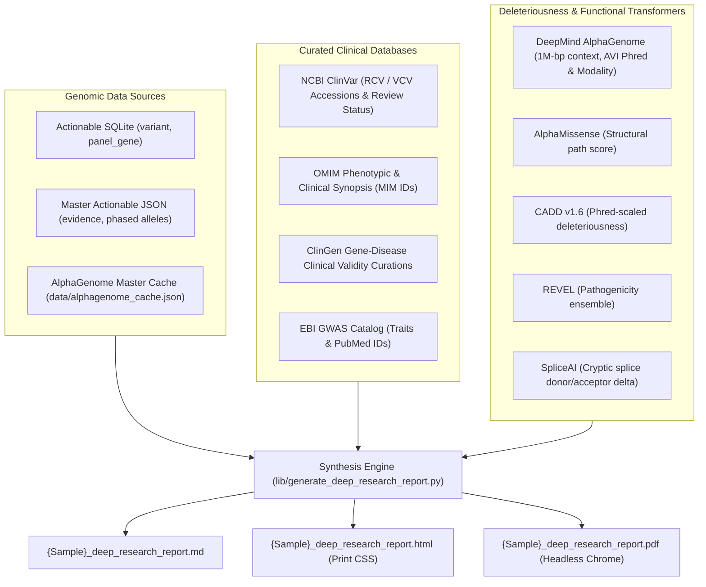

# Deep Genomic Research & Evidence Synthesis Skill

This skill governs the automated generation of concise, high-yield, 1-to-4 page Clinical Genomics Evidence Synthesis Reports for whole-genome sequencing (WGS) cohorts. It establishes an evidence reconciliation framework that cross-references monogenic disease databases with deep-learning biological foundation models to produce actionable clinical dossiers without factual extrapolation.

---

## 1. Architectural Overview & Evidence Stack

The synthesis engine bridges primary callsets with curated scientific databases and deep neural transformer scores:



---

## 2. Universal Trait-Driven Evidence Triage (Zero Hardcoded Gene Logic)

All variants are evaluated and prioritized using principled, domain-agnostic criteria without bespoke gene-specific branching:

### Category 1: Primary Monogenic & Clinically Actionable Findings
* **Inclusion Criteria:**
  1. ClinVar status `Pathogenic` or `Likely Pathogenic` without conflicting/uncertain submissions in a coding- or splice-altering variant, OR
  2. ClinGen `Definitive` or `Strong` validity variants linked to an established OMIM morbid disorder that confer high-impact cardioprotective/longevity effects (e.g. *APOB* Familial Hypobetalipoproteinemia 1), OR
  3. ClinGen `Definitive` variants with high-penetrance pharmacogenomic contraindications or thrombophilia risks (e.g. *F5* Factor V Leiden).
* **Clinical Reporting:** Structured narrative Evidence Dossier detailing molecular consequence, multi-engine in silico consensus (CADD, REVEL, AlphaMissense, AlphaGenome AVI score/modality/percentile), ClinGen validity, OMIM phenotypic mappings, and actionable surveillance/contraindication guidance.

### Category 2: Cardiovascular, Channelopathy & Hematology Surveillance
* **Inclusion Criteria:** Actionable Tier 1/2 variants in genes with cardiovascular, arrhythmia, lipid transport, or coagulation terms in Gene Ontology (`gene_go_bpo`) or Human Phenotype Ontology (`gene_hpo_term`).
* **Clinical Reporting:** Tabulated summary detailing arrhythmia/thrombophilia risk, REVEL/AlphaMissense scores, and driving AlphaGenome modalities (*Splicing*, *Cactus*, *AlphaMissense*).

### Category 3: Metabolic, Mitochondrial & DNA Repair Co-Factors
* **Inclusion Criteria:** Nuclear genes governing mitochondrial maintenance, transsulfuration/amino acid metabolism, or DNA repair machinery dynamically identified from ontology annotations.

### Category 4: Protective Alleles & Pharmacogenomic Contraindications
* **Inclusion Criteria:**
  1. **Protective / Longevity Trait Mining:** Variants tagged with `protective`, `hypobetalipoproteinemia`, `hypocholesterolemia`, `longevity`, or `reduced risk` across ClinVar significance, ClinVar disease, GWAS Catalog, or HPO.
  2. **Pharmacogenomic & Contraindication Discovery:** Variants tagged with `drug response`, `pharmacogenomic`, `toxicity`, `contraindicated`, or specific drug classes (valproate, lipid-lowering agents, fluoropyrimidines, arylamines) in ClinVar, PharmGKB, or clinical synopses.
* **Clinical Reporting:** Structured guidance defining the biological resistance mechanism, exact clinical contraindications against adverse medications or overtreatment, and tailored laboratory surveillance.

---

## 3. Mandatory VSCP-DF Structure, Limitations & Page Budget Constraints

The synthesis report must strictly observe the **Visual-Structural Cognitive Profile & Decision Framework (VSCP-DF)**:
1. **Length Constraint:** Exactly **1 to 4 printed pages** (rendered via `@media print` CSS in HTML and verified in vector PDF).
2. **Immediate Sentence-1 Content Delivery:** Zero conversational preambles, introductory filler, or flattering remarks.
3. **Four-Part Document Structure:**
   * `### Orientation: What We Are Covering` (Scope, sample ID, total variant counts by tier, reference build GRCh38).
   * `### Body` (Yourdon-style information flow diagram, prioritized comparison tables, narrative evidence dossiers for primary findings).
   * `### Conclusions: Diagnostic & Clinical Decision Calculus`:
     * `#### Arguments FOR Clinical Surveillance & Actionable Prophylaxis` (Actionable monogenic findings, critical pharmacogenomics, multi-model consensus).
     * `#### Arguments AGAINST Aggressive Over-Intervention & Report Limitations` (Autosomal recessive carrier asymptomacy, VUS non-actionability, paralogy/pseudogene representational artifacts, 40x short-read WGS detection limits).
     * `#### Patient Profile & Methodological Assumptions` (Documenting patient-specific directives: mosaicism/heteroplasmy expectations, annual re-analysis, pedigree phasing anchors, pan-genome GBZ mapping, and gVCF boundaries).
   * `### Opportunities: High-Yield Clinical Next Steps` (Actionable laboratory tests, EHR contraindication alerts, surveillance imaging, annual re-analysis cadence).
4. **Structured Confidence & Uncertainty Assessment:** Numerical score (0.00–1.00) accompanied by key assumptions and sequencing technology limitations (short-read 40x WGS boundaries).

---

## 4. Execution & Pipeline Integration

### Standalone CLI Execution
```bash
python3 lib/generate_deep_research_report.py \
  --sqlite reports/{SAMPLE_DIR}/{SAMPLE}_master_actionable.sqlite \
  --act-json reports/{SAMPLE_DIR}/{SAMPLE}_master_actionable.json \
  --ag-cache reports/{SAMPLE_DIR}/{SAMPLE}_alphagenome_cache.json \
  --out-dir reports/{SAMPLE_DIR} \
  --sample-name "{SAMPLE_NAME}" \
  --patient-id "{SAMPLE_ID}"
```

### Pipeline Stage 7.2 Integration
Executed automatically in `run_ontology_pipeline.py` after Stage 7.1 AlphaGenome TSV export:
* Generates `{Sample}_deep_research_report.md`
* Renders print-optimized `{Sample}_deep_research_report.html`
* Compiles vector `{Sample}_deep_research_report.pdf` via headless Chrome/Chromium
* Packages all three deliverables into `{Sample}_iOS_bundle.zip`
