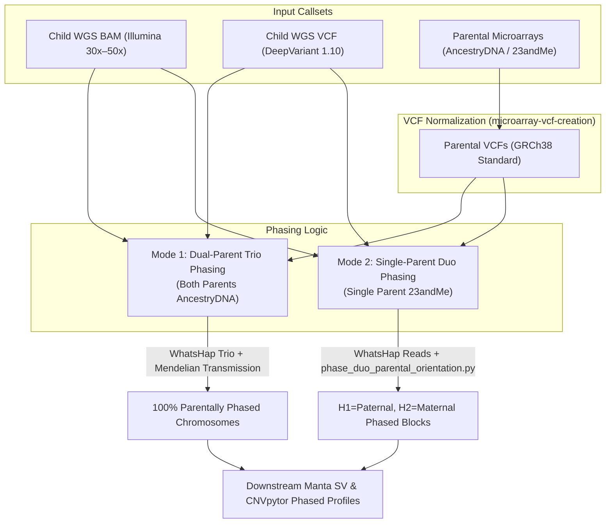

# Pedigree-Based Whole-Genome Phasing Skill

This skill governs the execution of pedigree-assisted haplotype phasing for whole-genome sequencing (WGS) data by integrating parental commercial genotyping microarrays (AncestryDNA and 23andMe) with child Illumina short reads.

---

## 1. Architectural Overview & Phasing Modes

Standard read-backed phasing (e.g. WhatsHap alone on short reads) is limited by fragment insert sizes (~400–600 bp), generating fragmented phase blocks (phase sets `PS`) interrupted by homozygous spans. Parental genotyping anchors connect these disjoint blocks across entire chromosomes:



---

## 2. Mode 1: Dual-Parent Trio Phasing (AncestryDNA + WGS)

When both parents have microarray data (e.g. AncestryDNA TSV):
1. Convert both parental TSVs to GRCh38 VCF using `convert_microarray_to_vcf.py`.
2. Merge Child VCF, Mother VCF, and Father VCF into a multi-sample VCF using `bcftools merge`.
3. Construct a standard 6-column pedigree file (`trio.ped`):
   ```
   #FAMID   INDID    FATID   MOTID   SEX   PHE
   FAM01    PROBAND  FATHER  MOTHER  1     1
   FAM01    FATHER   0       0       1     1
   FAM01    MOTHER   0       0       2     1
   ```
4. Execute `whatshap phase --ped trio.ped`:
   - WhatsHap uses dual-parent Mendelian inheritance constraints at every child heterozygous site where parents have discordant homozygous genotypes (e.g., Mother `0/0`, Father `1/1` $\rightarrow$ Child MUST be `1|0`).
   - Pairs with child short reads in `child.bam` to span ungenotyped regions.

### Embedded Trio Execution Script
```bash
#!/usr/bin/env bash
set -euo pipefail

# 1. Merge callsets
bcftools merge child.vcf.gz mother.vcf.gz father.vcf.gz -Oz -o trio_merged.vcf.gz
tabix -p vcf trio_merged.vcf.gz

# 2. WhatsHap Trio Phasing
podman run --rm -v /data:/data -v "${HOME}:${HOME}" \
  quay.io/biocontainers/whatshap:2.8--py310h184ae93_0 \
  whatshap phase \
  --ped trio.ped \
  --reference GRCh38.fa \
  --indels \
  -o child_trio_phased.vcf.gz \
  trio_merged.vcf.gz \
  child.bam

tabix -p vcf child_trio_phased.vcf.gz

# 3. Validation Metrics
podman run --rm -v /data:/data -v "${HOME}:${HOME}" \
  quay.io/biocontainers/whatshap:2.8--py310h184ae93_0 \
  whatshap stats --tsv=phasing_stats.tsv child_trio_phased.vcf.gz
```

---

## 3. Mode 2: Single-Parent Duo Phasing (23andMe + WGS)

When only ONE parent is sequenced (e.g. single maternal 23andMe TSV):
1. **Challenge:** Standard trio transmission cannot be resolved because the missing parent's alleles are unobserved. Furthermore, standard `whatshap phase` generates disjoint phase blocks whose phase orientation (which strand is paternal vs. maternal) randomly toggles at every phase block boundary.
2. **Solution (Two-Tier Phasing):**
   - **Tier 1 (Read-Backed Phasing):** Run `whatshap phase` on child WGS reads (`child.bam`) to assemble dense local phase sets (`PS`).
   - **Tier 2 (Anchor Orientation & Isolated Resolution):** Query all homozygous parental markers (`0/0` or `1/1`). For each phase block, tally maternal matches to determine whether Haplotype 1 or Haplotype 2 represents the maternal chromosome. Invert blocks as needed so **Haplotype 1 = Paternal** and **Haplotype 2 = Maternal** globally.
   - For isolated heterozygous child sites lacking read pairs, directly phase them using the parent's homozygous allele.

### Embedded Standalone Orientation Script: `phase_duo_parental_orientation.py`
```python
#!/usr/bin/env python3
import sys
import pysam

def phase_duo_orientation(child_vcf, parent_vcf, output_vcf, child_sample="PROBAND", parent_sample="PARENT", role="maternal", chrom=None):
    # 1. Collect parental homozygous anchors
    parent_in = pysam.VariantFile(parent_vcf)
    anchors = {}
    fetch_args = [chrom] if chrom else []
    for rec in parent_in.fetch(*fetch_args):
        gt = rec.samples[parent_sample]['GT']
        if gt in [(0, 0), (1, 1)]:
            anchors[(rec.chrom, rec.pos)] = (rec.ref, rec.alts, gt[0])
    parent_in.close()

    # 2. Score block orientation
    child_in = pysam.VariantFile(child_vcf)
    block_scores = {}
    for rec in child_in.fetch(*fetch_args):
        gt = rec.samples[child_sample]['GT']
        ps = rec.samples[child_sample].get('PS')
        if gt in [(0, 1), (1, 0)] and ps is not None:
            key = (rec.chrom, rec.pos)
            if key in anchors:
                pref, palts, pallele = anchors[key]
                if pref == rec.ref and palts == rec.alts:
                    ps_key = (rec.chrom, ps)
                    block_scores.setdefault(ps_key, {'h1': 0, 'h2': 0})
                    if gt[0] == pallele:
                        block_scores[ps_key]['h1'] += 1
                    elif gt[1] == pallele:
                        block_scores[ps_key]['h2'] += 1
    child_in.close()

    # Invert blocks if H1 matched maternal instead of H2
    blocks_to_invert = set()
    for ps_key, score in block_scores.items():
        if role.lower() == "maternal" and score['h1'] > score['h2']:
            blocks_to_invert.add(ps_key)
        elif role.lower() == "paternal" and score['h2'] > score['h1']:
            blocks_to_invert.add(ps_key)

    # 3. Write standardized output
    child_in = pysam.VariantFile(child_vcf)
    header = child_in.header.copy()
    if 'PS' not in header.formats:
        header.formats.add('PS', 1, 'Integer', 'Phase set identifier')
    out_vcf = pysam.VariantFile(output_vcf, 'w', header=header)

    for rec in child_in.fetch(*fetch_args):
        new_rec = rec.copy()
        gt = rec.samples[child_sample]['GT']
        ps = rec.samples[child_sample].get('PS')
        if gt in [(0, 1), (1, 0)]:
            ps_key = (rec.chrom, ps)
            if ps is not None:
                if ps_key in blocks_to_invert:
                    new_rec.samples[child_sample]['GT'] = (gt[1], gt[0])
                new_rec.samples[child_sample].phased = True
            else:
                key = (rec.chrom, rec.pos)
                if key in anchors:
                    pref, palts, pallele = anchors[key]
                    if pref == rec.ref and palts == rec.alts:
                        alt = 1 if pallele == 0 else 0
                        if role.lower() == "maternal":
                            new_rec.samples[child_sample]['GT'] = (alt, pallele) # H1=Pat, H2=Mat
                        else:
                            new_rec.samples[child_sample]['GT'] = (pallele, alt)
                        new_rec.samples[child_sample]['PS'] = rec.pos
                        new_rec.samples[child_sample].phased = True
        out_vcf.write(new_rec)
    child_in.close()
    out_vcf.close()

if __name__ == "__main__":
    phase_duo_orientation(sys.argv[1], sys.argv[2], sys.argv[3])
```

---

## 4. Phased Structural & Copy Number Integration

Once small variants (SNVs & INDELs) are parentally phased:

### A. Phasing Structural Variants (Manta 1.6.0 + WhatsHap)
WhatsHap integrates phased SNVs to phase large deletions, duplications, and insertions from Manta:
```bash
podman run --rm -v /data:/data -v "${HOME}:${HOME}" \
  quay.io/biocontainers/whatshap:2.8--py310h184ae93_0 \
  whatshap phase \
  --reference GRCh38.fa \
  -o child_phased_sv.vcf.gz \
  manta_pass_svs.vcf.gz \
  child.bam
```

### B. Phased B-Allele Frequency for CNVpytor (1.3.1)
Export phased SNVs into CNVpytor to reconstruct allelic imbalance and loss of heterozygosity (LOH) alongside read depth (RD):
```bash
cnvpytor -root sample.pytor -snp child_phased_snv.vcf.gz -sample PROBAND
cnvpytor -root sample.pytor -baf 10000 100000
cnvpytor -root sample.pytor -call 10000
```
